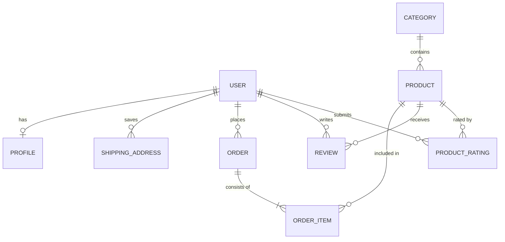

# 🛒 Amazon Clone — Full-Stack E-Commerce Platform

<p align="center">
  
  
  
  
  
</p>

> A modern, full-featured **Amazon E-Commerce Clone** developed in **Python & Django**. This platform replicates core Amazon shopping experiences including dynamic multi-category product catalogs, session-backed shopping carts, star ratings & customer reviews, user profile management, secure multi-step checkout with automated shipping address profiles, and an administrative order dispatch dashboard.

---

## 🌟 Key Features

### 🛍️ 1. Dynamic Product Catalog & Search
- **Category Browsing**: Filter items by department and categories (Electronics, Fashion, Home & Kitchen, Books, etc.).
- **Product Details & Media**: High-resolution image galleries, dynamic pricing, stock level tracking, and detailed product descriptions.
- **Search Engine**: Real-time product search by keyword across all categories.

### ⭐ 2. Ratings & Review System
- **Interactive Star Ratings**: Authenticated users can rate purchased products on a 5-star scale.
- **Customer Reviews**: Submit detailed written feedback displayed on individual product pages.

### 🛒 3. Real-Time Session Shopping Cart
- **Persistent Session State**: Powered by Django sessions, allowing guest and registered users to maintain their cart across page refreshes.
- **AJAX Dynamic Updates**: Add, modify item quantities, and remove items with instant subtotal and total calculations without page reloads.

### 💳 4. Checkout & Order Fulfillment
- **Multi-Step Checkout**: Captures shipping addresses, contact details, and billing information.
- **Auto-Populated Profiles**: Automatically creates and syncs user shipping addresses across repeat orders.
- **Order Tracking**: Generates immutable `Order` and `OrderItem` records upon purchase.
- **Email Notifications**: Automated email order confirmations sent via SMTP backend.

### 📦 5. Admin & Shipping Dashboard
- **Dedicated Dispatch Interface**: Administrative dashboard (`/payment/shipped_dash/`) to monitor pending versus shipped orders.
- **Automated Timestamping**: Tracks exact dispatch dates using Django `pre_save` signals.

---

## 🏗️ Architecture & App Structure

```
Amazon/
├── Amazon/                  # Django project root settings and routing
│   ├── settings.py          # App config, media/static configuration & SMTP settings
│   ├── urls.py              # Global URL dispatchers
│   └── wsgi.py
├── Amazonapp/               # Main storefront app
│   ├── models.py            # Category, Product, Profile, Review, Rating models
│   ├── views.py             # Product listing, auth, profile & review views
│   └── templates/           # Home, Category, Product Detail, Profile, Auth templates
├── cart/                    # Shopping cart management
│   ├── cart.py              # Session-based Cart state class
│   ├── views.py             # Cart add, update, delete, summary endpoints
│   └── templates/           # Cart summary page
├── payment/                 # Billing, orders & fulfillment
│   ├── models.py            # ShippingAddress, Order, OrderItem models
│   ├── views.py             # Checkout, order processing, shipping dashboard
│   └── templates/           # Checkout, payment success, shipped dashboard
├── static/                  # Stylesheets, JavaScript, Bootstrap assets, UI icons
├── media/                   # Dynamic product and category uploads
├── manage.py
├── requirements.txt
└── .env.example
```

---

## 🚀 Quickstart & Installation

### Prerequisites
- **Python 3.10+**
- **Git**
- **pip**

### 1. Clone the Repository
```bash
git clone https://github.com/Mahum-20/Amazon-Clone.git
cd Amazon-Clone
```

### 2. Create and Activate a Virtual Environment
```bash
# Windows
python -m venv venv
venv\Scripts\activate

# macOS / Linux
python3 -m venv venv
source venv/bin/activate
```

### 3. Install Dependencies
```bash
pip install -r requirements.txt
```

### 4. Configure Environment Variables
Copy `.env.example` to `.env` or set your local environment variables:
```bash
cp .env.example .env
```

### 5. Apply Database Migrations
```bash
python manage.py makemigrations
python manage.py migrate
```

### 6. Create Superuser (Admin)
```bash
python manage.py createsuperuser
```

### 7. Run the Development Server
```bash
python manage.py runserver
```

Open your browser and navigate to: `http://127.0.0.1:8000`

---

## 🧪 Database Models Overview



---

## 🔒 Security Best Practices

- **Environment Separation**: Secrets, debug toggles, and SMTP authentication credentials are decoupled via environment variables.
- **CSRF Protection**: All POST forms include Django standard CSRF tokens.
- **Password Hashing**: Authentication utilizes PBKDF2 with SHA-256 password hashing.

---

## 📄 License

This project is licensed under the **MIT License** — see the [LICENSE](LICENSE) file for details.
